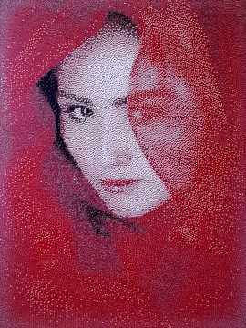

# Image inkifier

Automatically convert images for Pimoroni's InkyWHAT and InkyPHAT boards!

 

This is a collection of code for converting and displaying images on Pimoroni's [InkyWHAT](https://shop.pimoroni.com/products/inky-what?variant=13590497624147) or [InkyPHAT](https://shop.pimoroni.com/products/inky-phat?variant=12549254938707) eInk add-on boards for the Raspberry Pi.

EInk displays use tiny particles of pigment which are pulled to the front of the screen by electrical charges.  This means that unlike most screen technologies, eInk screens don't emit light themselves: ambient light reflects off the pigment particles, giving it an appearance not entirely unlike pigment particles on paper.  

Because eInk uses a very different technology to most display types, images need a bit of processing before they can be shown properly.  Pimoroni describe how to do this manually in thier [Getting Started with InkyPHAT Guide](https://learn.pimoroni.com/tutorial/sandyj/getting-started-with-inky-phat), but this repo automates that process enabling the display of images from the command line.  It also allows for modifications to be made to the brightness, sharpness or contrast of the image, and will automatically resize the image to be appropriate for the selected Inky board.

Currently this script uses the Pillow module to open an image file and alter the brightness, sharpness and/or contrast of the image.  The image is resized if required to fit the device, and then gets saved to `/tmp` where GIMP ([the GNU Image Manipulation Program](https://www.gimp.org/)) opens it and converts the full-colour image into a 2- or 3-colour format compatible with Pimoroni's InkyWHAT screens.  Finally, the image is displayed on the WHAT/PHAT.

# Installation

1) Start by checking your Pi is up to date: `sudo apt-get update && sudo apt-get upgrade`.
2) Clone this Git repo: `git clone https://github.com/UnfinishedStuff/ImageInkifier.git`
3) If you haven't done so already, install Pimoroni's Inky module: `curl https://get.pimoroni.com/inky | bash`
4) Install GIMP: `sudo apt-get install gimp`
5) We need to add some of the files in the Git repo into GIMP's folders, but they won't be created until GIMP is run at least once.  Try running the example script (you'll need to pass it an image to use).
6) Copy InkyPalette.gpl from the Git repo to `~/.config/GIMP/2.10/palettes`.
7) Copy inkify.scm to `~/.config/GIMP/2.10/scripts`.

# Using the example script

The example script is intended to be run from Bash and passed the information it needs to show an image.  The structure of arguments are as follows: `python3 example.py -m str -t str -i str -b float -c float -s float`
* `-m` is the model of Inky board, and should be `InkyWHAT` or `InkyPHAT` (note that in Bash these strings don't need surrounded in quotation marks).
* `-t` is the type of board, and should be `red`, `black`, or `yellow`.
* `-i` is the path to the image to be shown.
* `-b`, `-c`, and `-s` are values for modifications of the brightness, contrast and sharpness of the image respectively.  These should be floats between 0 and 2, where 1 is no change, >1 is an increase and <1 is a decrease in that value.  These are the only arguments which are optional, so if you don't want to change these then you don't have to include them.

For example, to show `image.jpg` on a red InkyWHAT with a slight increase in contrast, a large decrease in brightness, and no change in sharpness you would use:
`python3 example.py -m InkyWHAT -t red -i image.jpg -c 1.1 -b 0.6`

# Some notes on image choice

How well this works depends heavily on which Inky board you have and on how well the images convert down to just two or three pixel colours.  Simple images often work best, although the red (and presumably yellow) boards can work well if that is the only colour in the image.  Try it and see, I've found that sometimes slight increases in brightness and contrast really imrpove the results.

If you have a red InkyWHAT try [Charlie Marshall's "Veiled in Red"](https://commons.wikimedia.org/wiki/File:Veiled_in_Red.jpg), it works incredibly well.

# Things to note, things to do

* I should probably look into whether or not this really needs a class of its own.  Something which I discovered about how Inky and GIMP work changed how I thought I'd have to write this program, so it may not longer be required.
* All of this was tested on a red InkyWHAT and InkyPHAT in both red and black modes.  It *should* work with the yellow versions of the boards but I don't have one to try.  If you have one let me know how it goes!
* Some sort of image rotation function would be very helpful.

# Acknowledgements

Huge thanks to Glenn Horan ([@Batglenn13](https://twitter.com/batglenn13)) whose photos of his dog Floki largely inspired this project.  You can see him in the image at the top of this Readme file (the dog, not Glenn!).
